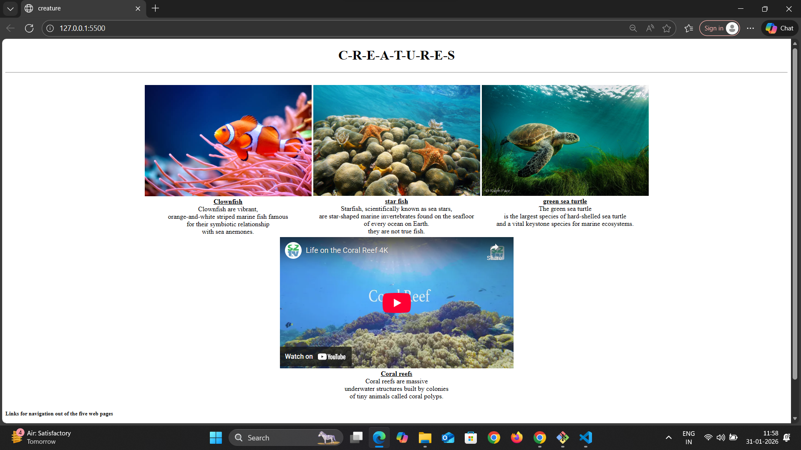

# MARINE-LIFE-EXPLORER🪼
This my HTML assignment project where i can share the information about marine lifes.

In this project i can used `HTML` tags like `ul`   `image` `video` `a`etc to create a informative page.
In which  diffrent diffrent fishes images along with there short discription about this fishes added.

## Screenshots

## contributors

